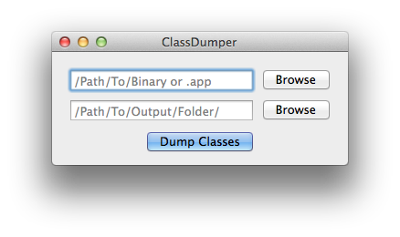

# ClassDumper
ClassDumper is a simple Mac Application to use ClassDump without going through the command-line.  Simply drag and drop the file paths of the executable/.app bundle and the output path and hit "Dump Classes"

## Usage

To use, simply give a path to a file that you want to dump classes from and the path where you want the headers to be stored.  Simply hit "Dump Classes" and verify.

## OS Support

* Mac OS X 10.8+

## License
MIT license. Copyright © 2015 [Shmoopi LLC](http://shmoopi.net/).